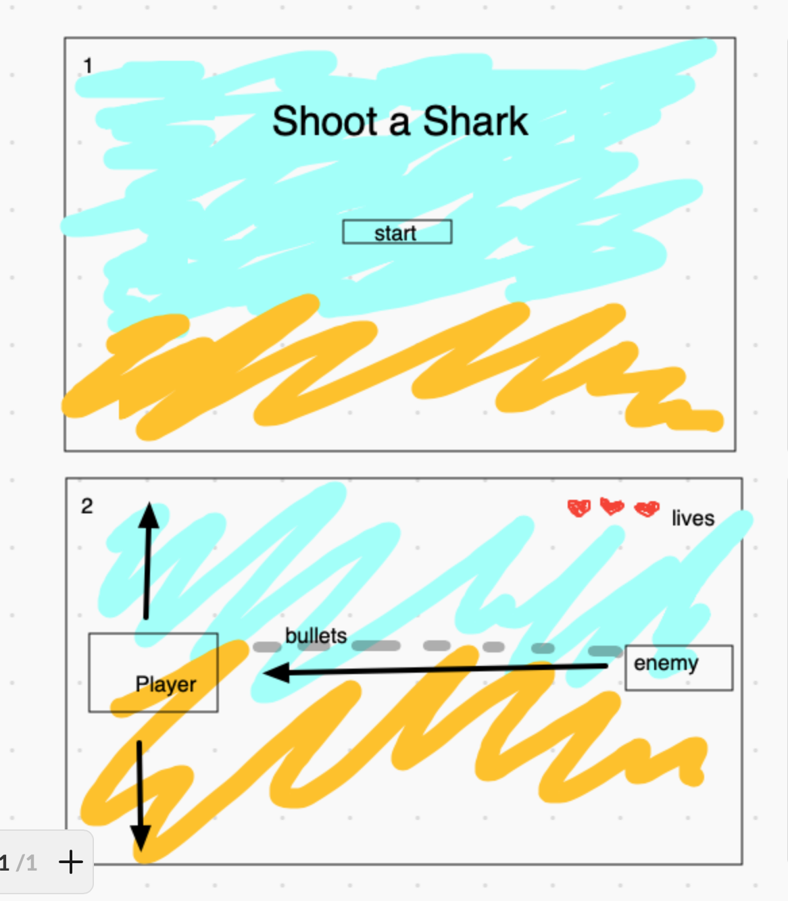

# Shoot a Shark

# Overview
A fun game that is created in HTML, CSS, Javascript. It is a shooting game, I used "Under the sea" theme, which has "Under The Sea" background, submarine as a Player and shark as an Enemy. Player needs to shoot a shark before the shark hits submarine. I picked up this game because it's animated, and i find it easy and fun to play.  

# Game rules

 - Submarine ("Player") should shoot a shark ("Enemy") that is appearing and swimming towards the Player. 
- Player should use keyboard letters to be able to move up and down the screen, keyboard letters are: "s" for UP and "w" for DOWN.
- If the bullet hits shark, shark will explode and dissapear, and then other shark will appear.
- Player has 3 lives, if the Enemy reaches Player, then the Player will loose 1 life out of 3, and if the Enemy hits 3 times, then the Player looses the game.
- Player is in a winning position as long as he has lives.

# Wireframes

# User stories

- When open a game, welcome start screen is displayed
- If Player hits the start button, Player appears, and the Enemy starts to appear towards the Player.
- When Player clicks either "s" or "w" keybord, it will move Player Up and Down.
- When Player, clicks space, he is able to shoot the Enemy.
- When Enemy appears it moves towards the Player. 
- If Player can't shoot the shark and it hits to the Player, then the Player looses 1 life.
- If the Player looses 3 lives, then the Player is lost.

# MVP checklist

- Welcome start screen
- Start button
- Create Player and Enemy
- Make Player move Up and Down using keyboard letters
- Make a bullet shot using a space
- Make a bullet to get out of Player and move towards the Enemy
- Make a bullet hit the Enemy
- Make a Player 3 lives
- Make 3 lives to become less if the Enemy reaches the Player
- Make the Enemy move horizontally towards the Player

# Stretch goals

- If a bullet hits the Enemy then the Enemy explodes, add sound of an explosion
- Add a sound of the shooting bullets.
- Make more than one Enemies to appear after each 1-2 seconds.